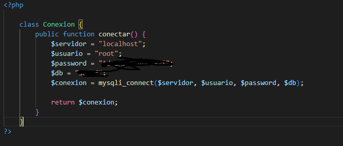
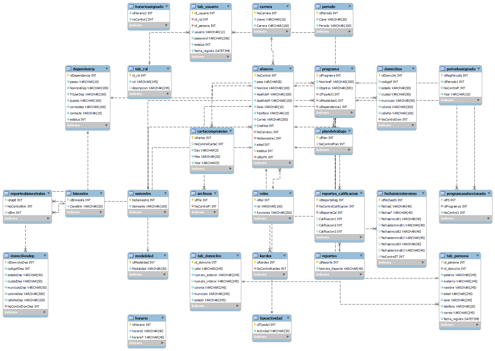

# portafolio
Proyectos de desarrollo web
# Caracteristicas

- Plataforma para gestion de reportes de Servicio Social;
- Alta, baja y actualizacion de usuarios, programas, dependencias y consulta de programas asignados;
- Generacion de reportes y documentos iniciales por parte de los alumnos de acuerdo al proceso de servicio social;
- Registro y login tanto de alumnos como administrativos;
- Carga de archivos en el servidor segun las fechas en que se tenga que reportar;
- Notificacion mediante correos electronicos;
- Descarga de archivos por parte del administrador para su revision;

# Instalacion e implementacion

- Con el codigo descargado deberas extraer la carpeta en el directorio de su servidor sea WAMP, XAMPP o caso mio el root de IIS;
- Deberas modificar los archivos de conexion a la base de datos con el fin de poder acceder a ella de acuerdo a su entorno de base de datos, modificar especificamente la contraseña por la de ustedes, toma en cuenta que existe mas de un archivo de conexion en el proyecto;

- Exportar la base de datos al gestor de base de datos que esten utilizando;
- Recomiendo enormemente crear la base de datos manualmente y abrir el archivo SQL de manera manual con un editor de codigo para crear las tablas y relaciones desde cero con el fin de que sepa que CONSTRAINT estan declarando para cada relacion, igualmente recomiendo agregren la restriccion DELETE ON CASCADE al crear la relacion ya que se puden ahorrar muchos query con ello;
- Para mayor entendimiento de las instrucciones anteriores dejo un diagrama de la base de datos;

- Pueden notar en mi diagrama que algunas relaciones no las marca, esto es debido a un error en mi interfaz grafica pero los nombres son muy intuitivos a fin de que otros puedan entenderlo;
- Existen tablas las cuales no se estan utilizando, la razon de ello es que este proyecto se pretende escalar en cuanto la dependencia obtenga la autorizacion, de ahi que se dejaron tablas considerando futuras actualizaciones;
