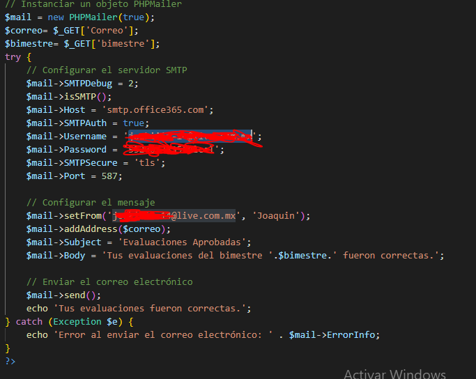
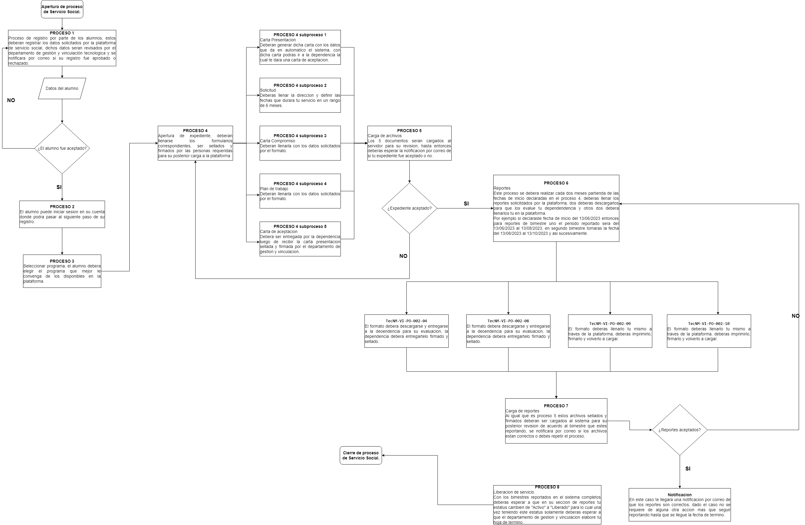
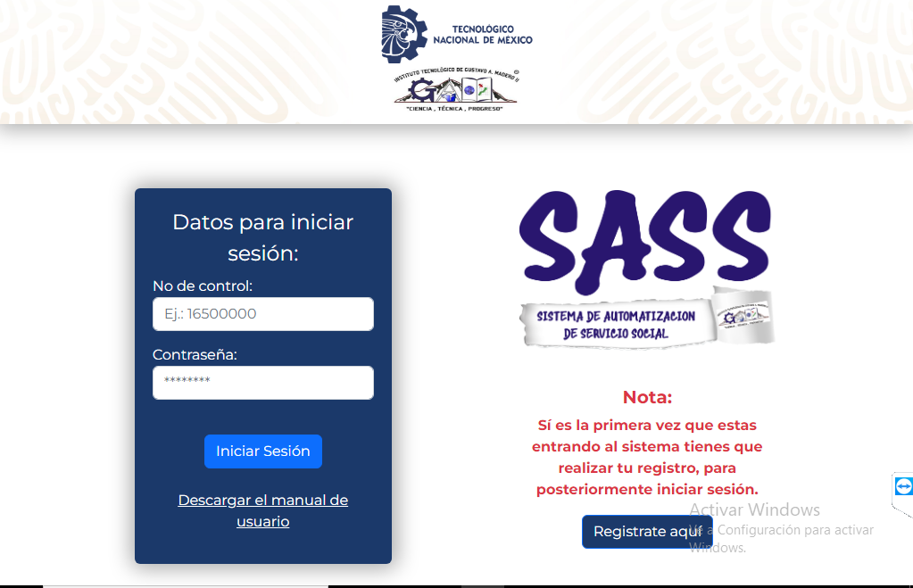

# Portafolio
Plataforma de Servicio Social Escolar
# Caracteristicas

- Plataforma para gestion de reportes de Servicio Social;
- Alta, baja y actualizacion de usuarios, programas, dependencias y consulta de programas asignados;
- Generacion de reportes y documentos iniciales por parte de los alumnos de acuerdo al proceso de servicio social;
- Registro y login tanto de alumnos como administrativos;
- Carga de archivos en el servidor segun las fechas en que se tenga que reportar;
- Notificacion mediante correos electronicos;
- Descarga de archivos por parte del administrador para su revision;

# Instalacion e implementacion

## Extraccion y Configuracion

- Con el codigo descargado deberas extraer la carpeta en el directorio de su servidor sea WAMP, XAMPP o caso mio el root de IIS;
- Deberas modificar los archivos de conexion a la base de datos con el fin de poder acceder a ella de acuerdo a su entorno de base de datos, modificar especificamente la contraseña por la de ustedes, toma en cuenta que existe mas de un archivo de conexion en el proyecto;

## Base de datos

- Exportar la base de datos al gestor de base de datos que esten utilizando;
- Recomiendo enormemente crear la base de datos manualmente y abrir el archivo SQL de manera manual con un editor de codigo para crear las tablas y relaciones desde cero con el fin de que sepa que CONSTRAINT estan declarando para cada relacion, igualmente recomiendo agregren la restriccion DELETE ON CASCADE al crear la relacion ya que se puden ahorrar muchos query con ello;
- Para mayor entendimiento de las instrucciones anteriores dejo un diagrama de la base de datos;

- Pueden notar en mi diagrama que algunas relaciones no las marca, esto es debido a un error en mi interfaz grafica pero los nombres son muy intuitivos a fin de que otros puedan entenderlo;
- Existen tablas las cuales no se estan utilizando, la razon de ello es que este proyecto se pretende escalar en cuanto la dependencia obtenga la autorizacion, de ahi que se dejaron tablas considerando futuras actualizaciones;

## Correos
- Para la configuración de archivos de correo se requiere tener una cuenta de outlook, solo debes sustituir los campos indicados con tu contraseña y tu correo, el archivo por si mismo ya extraera los correos destinatarios de la base de datos de acuerdo a los botones que elija el administrador del sistema;

- Dentro de la carpeta correos se encuentran todos los archivos que requieren la configuracion antes mencionada, dentro mismo existe un archivo aun en fase de pruebas que de poder implementarse adecuadamente sera caoaz de enviar correos automaticamente segun las fechas registradas, para poner a prueba este archivo cuyo nombre es recordatorios.php debera utilizar el programador de tareas de windows para poder ejecutarlo periodicamente;

## Direcciones
- Los alumnos al momento de llenar su solicitud luego de haberse registrado, ser autorizados y haber seleccionado un programa deberan llenar su direccion, dicha direccion puede ser llenada en automatico con el codigo postal, para esto deberan descargar una api de la cual dejare el link de otro repositorio de mi cuenta para poder acceder a ella, recomiendo cambien el nombre de la carpeta a MEXICO para que no tengan problemas al utilizarla;
- https://github.com/Joakiiin/ESTADO_MEXICO ;

# Manual de Alumno
## Diagrama de proceso de servicio social

- El diagrama de la parte superior no muestra la manera en que la organización gestionara su proceso, esto puede verse sujeto a adaptaciones segun la necesidad de la organización pero para este caso el sistema funcionara acorde a estas requisiciones;

## Proceso de registro
- Para este primer paso deberas pulsar el boton registrate aqui en la plataforma, esto a su vez te llevara a un nuevo formulario el cual deberas llenar lo que te este te solicita.

